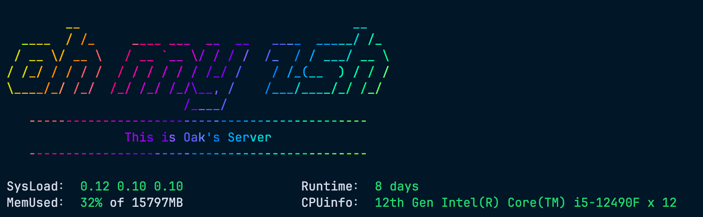

# Terminal-Started-Theme

> This project was inspired by Oh My Zsh. Every time Oh My Zsh updates, the terminal displays stunning colorful ASCII art that leaves a lasting impression. Since this visual effect only appears during updates, I created this project to bring a similar experience every time you connect via SSH.

A customized terminal startup theme that displays colorful ASCII art and system information when connecting via SSH.

## 🌟 Features

- Rainbow ASCII art welcome banner
- System information display including:
    - System load
    - Memory usage
    - System uptime
    - CPU model and cores

## 📸 Preview



## 🚀 Installation

1. Clone this repository:
```bash
git clone https://github.com/yourusername/Terminal-Started-Theme.git
```

2. Choose your preferred setup and copy the corresponding code:
- For SSH connections only: Copy the "SSH-only" section from `.zshrc`
- For all terminal sessions: Copy the "ALL Terminal Theme" section from `.zshrc`

Add your chosen section to your shell configuration file:
```bash
# For zsh users
cat YOUR_CHOSEN_SECTION >> ~/.zshrc

# For bash users
cat YOUR_CHOSEN_SECTION >> ~/.bashrc
```

3. Install required dependencies:
```bash
# For Ubuntu/Debian
sudo apt-get install lolcat figlet
```

💡 **Tip**: You can customize the rainbow text effect by modifying lolcat parameters, for example: `lolcat -f -F 0.5` will change the speed and frequency of color transitions.
💡 **Tip**: You can use `figlet` command to generate ASCII text art banners with different fonts. Try `figlet -f slant "Your Text"` to create similar ASCII art.
💡 **Tip**: Alternatively, you can generate ASCII art without figlet using the online tool [ASCII-generator](https://github.com/vietnh1009/ASCII-generator).

## 💡 Requirements

- Zsh shell or Bash shell
- lolcat package
- figlet package
- SSH connection (theme only displays when connecting via SSH)

## 📄 License

MIT License

